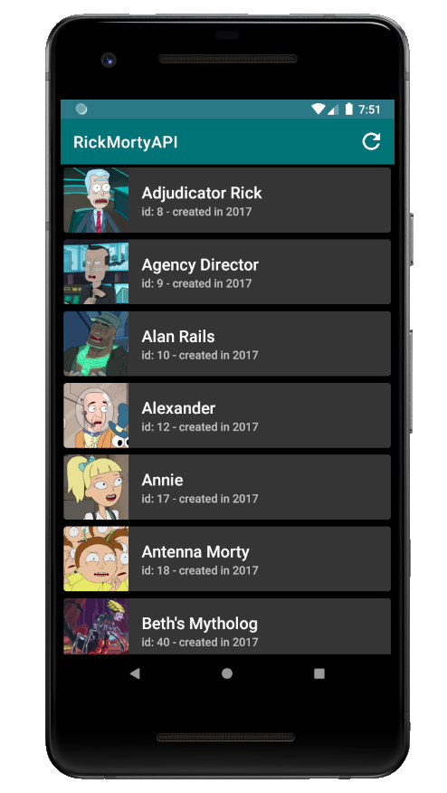

# Rick and Morty API MVVM
I developped a Rick and Morty themed Android application (with Kotlin) implementing the MVVM architecture. I used the [Rick and Morty API](https://rickandmortyapi.com/) and focused on the characters part. Using the api, I display a list of 20 (random) characters and each list item when clicked displays a Custom Alert Dialog with more details about the selected character.

### Used tools
 - Retrofit
 - Dagger2
 - Databinding
 - RxAndroid
 - Room
 - LiveData
 - RecyclerView
 - Glide
 - Material Design
 - and others...

### Screenshots from the application
| List View  | Card View |
| --- | --- |
|   |  |
